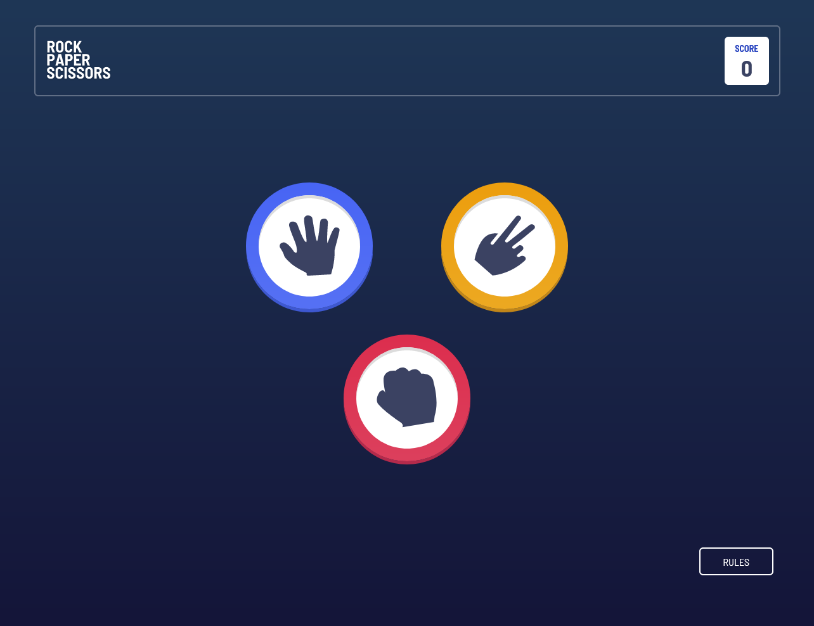

#  Rock, Paper, Scissors solution

This is a rock, paper, scissors game.

## Table of contents

- [Overview](#overview)
  - [The challenge](#the-challenge)
  - [Screenshot](#screenshot)
  - [Links](#links)
- [My process](#my-process)
  - [Built with](#built-with)
  - [What I learned](#what-i-learned)
  - [Continued development](#continued-development)
  - [Useful resources](#useful-resources)
- [Author](#author)

## Overview

### The challenge

Users should be able to:

- View the optimal layout for the game depending on their device's screen size
- Play Rock, Paper, Scissors against the computer
- Maintain the state of the score after refreshing the browser _(optional)_
- **Bonus**: Play Rock, Paper, Scissors, Lizard, Spock against the computer _(optional)_

### Screenshot



### Links

- Solution URL: [GitHub Repository](https://github.com/11kyle/rock-paper-scissors)
- Live Site URL: [Live Preview](https://11kyle.github.io/rock-paper-scissors/)

## My process

### Built with

- Semantic HTML5 markup
- CSS custom properties
- Flexbox
- CSS Grid
- Mobile-first workflow
- [React](https://reactjs.org/) - JS library
- [Next.js](https://nextjs.org/) - React framework
- [Tailwind CSS](https://tailwindcss.com/) - For styles

### What I learned

Use this section to recap over some of your major learnings while working through this project. Writing these out and providing code samples of areas you want to highlight is a great way to reinforce your own knowledge.

To see how you can add code snippets, see below:

```html
<h1>Some HTML code I'm proud of</h1>
```
```css
.proud-of-this-css {
  color: papayawhip;
}
```
```js
const proudOfThisFunc = () => {
  console.log('🎉')
}
```

If you want more help with writing markdown, we'd recommend checking out [The Markdown Guide](https://www.markdownguide.org/) to learn more.

### Continued development

Use this section to outline areas that you want to continue focusing on in future projects. These could be concepts you're still not completely comfortable with or techniques you found useful that you want to refine and perfect.

**Note: Delete this note and the content within this section and replace with your own plans for continued development.**

### Useful resources

- [Stack Overflow](https://stackoverflow.com/) - Possible the best overall place to get help from the community. You can find a solution to every problem you face and if not, post your own.
- [MDN Web Docs](https://developer.mozilla.org/en-US/) - MDN Web Docs are great for reminding you everything you forget. I often use it to look up attributes for html tags and JavaScript methods.
- [Tailwind CSS](https://tailwindcss.com/) - This is the documentation for TailwindCSS. It's always open when I use it as my CSS framework.
- [Deploying a React App to GitHub Pages](https://github.com/gitname/react-gh-pages) - This is the documentation on how to deploy a React App to GitHub Pages.

## Author

- Frontend Mentor - [Kyle](https://github.com/11kyle)
- LinkedIn - [Kyle](https://www.linkedin.com/in/kylejohnsondeveloper/)